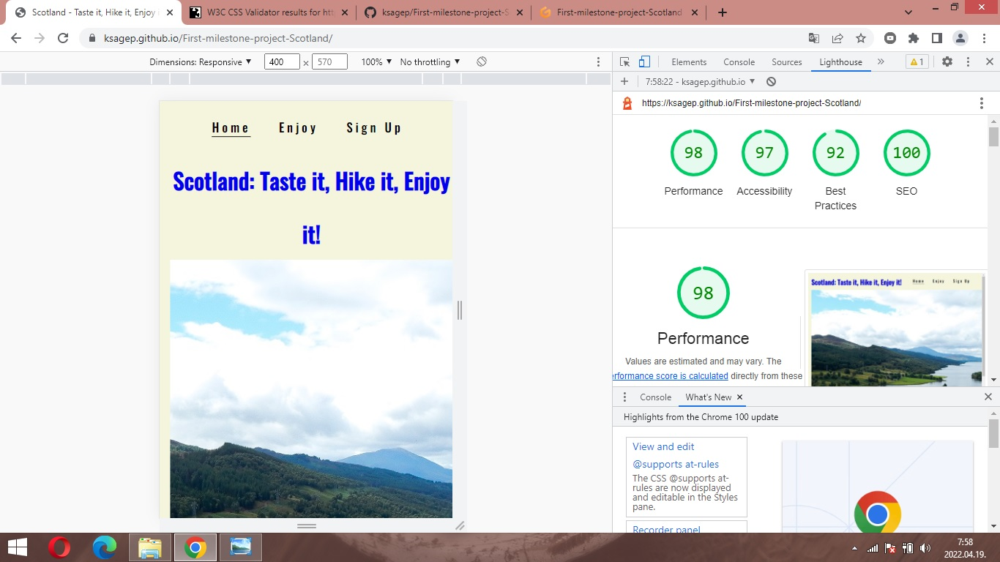

# Scotland - Taste it! Hike it! Enjoy it!

I took the advice of my mentor and the teachers of the Code Institute's Diploma in Software Development Course and I have created a website which I liked and enjoyed the development of it. I was lucky because I could visit this great country with my friends some years ago.

For link to this website click [Here](https://ksagep.github.io/First-milestone-project-Scotland/).

Design has been focused to *Desktop, Laptop and Tablet first* and *Responsive* but it is also working on mobile assets.

## Who is this website for?

This webpage contains information which most of them based on own experience.These information would help for tourists who will visit Scotland. I travelled from Edinburgh up to the Isle of Skye and go back to Edinburgh along the western coast of Scotland. This website is contained the essence of this trip.

## What does this website do?

The website serves as a collection of snapshots. It could help for tourist to provide some proposals when they plan their trip in Scotland. The movie makers chose Scotland many times and the tourist could visit these place (e.g Eilean Dolan castle - Highlander, Glenfinnan Viaduct - Harry Potter, Rosslyn Chapel - Da Vinci Code :) ). The website also provides some ideas what could taste during the visit.

## UX 5 Planes

### Strategy Plane

This page was created in a simple way. The information is clear and serves to help the visitors of the website.

### Scope Plane

In this project You can find the following features:
* The header and footer are common in every pages
* Three different pages which are as follows:

- Home page contains a picture what I took at the 'Queen's View' and two other buttons to other pages

- Enjoy page contains pictures about drinks, foods and attractions which could visit during the trip

- Sign Up page contains the opportunity to create a contact with me and I could share some information in private session

### Structure Plane

The three pages provide various information about different themes. These provide a possibility for visitors that they could choose the most appropriate theme they would be interest in. 

### Skeleton Plane

Design was focused on big screen (desktop, laptop) primarily but you can use this website on mobile also.

### Surface Plane

* Colors

For navigation and footer part of the website the main aim was the big contrast it was the reason why I used #0a0a0a/black on a light background (beige - rgb 245, 245, 220).

* Typography

I used two types of fonts what I downloaded from the Google Fonts families:

**Tourney** (weight: 700)

**Oswald** (weight: 500)

## Features

### Existing Features

* Created in HTML5 and CSS3
* Three different pages

### Features for future implementation

* Travel information by car, by train, by plane or by ferry
* Weather information and proposals
* Events proposals
* Short description of whiskey distillation
* COVID-19 actual news and obligations
* Map to show the locations of the places what I visited

## Technologies

- HTML5 for basic structure of the website
- CSS3 for style the website
- Google Fonts for fonts families
- Font Awesome for social media icons
- Git for version control
- GitHub for storage the files and steps of development of the website

## Resources

- Code Institute course materials
- Code Institute Slack Community for some helps
- Code Institute Mentor meetings and support
- Code Institute tutor support
- Am I Responsive for a responsive image in README 
- the culture trip for some pictures of the food
- jolly tomato for image of the Scottish egg
- wikipedia for image of the black and white pudding
- cinnamonhotels for image of the grilled Scottish salmon
- candyfactory for image of the Irn-Bru
- ongewonlekker for image of the Botanist gin
- tasteatlas for image of the Atholl Brose, Glayva, Scottish beers
- wikipedia for image of the Scottish whiskies

## Testing

### Browser testing

Website was tested in Google Chrome, Opera, Microsoft Edge and Safari. On each browser this website works properly (functionality, visuality).

It was tested on  Macbook Pro, Apple iPhone 13 Pro and Samsung A6 and A10 mobile phones and the website worked on these type of devices.

### Validators

The website was checked by W3C HTML validator and it did not reported any issues. You can find the result [Here](assets/images/W3C%20HTML%20assessment.jpg).

The website was checked by W3C CSS validator and it did not reported any issues. You can find the result [Here](assets/images/W3C%20CSS%20assessment.jpg).

### Local testing

The buttons of the website were tested locally and these worked properly.

### Responsiveness

I used Google Chrome Dev Tools for this exercise. I tested for mobile and desktop devices. According to the tool, some images were big for mobile devices and the downloads were slow.

Lighthouse mobile assessment:

Lighthouse desktop assessment:

## Version control

I used two repositories during the development: GitPod for local repository and GitHub for remote or background repository. 

I managed the versions with the followung process:
- I created a repository in GitHub
- I opened and developped the repository in GitPod
- I created and developped the files and folders in GitPod
- I saved and pushed my works to GitHub repository:
    1. git add . - adding work to git
    2. git commit -m "Commit message" - to commit the stage of work
    3. git push - to update my work in GitHub

## Publish the project

The steps of the publishing on the GitHub were as follow:
    
    1. **"Settings"** on the repository
    2. **"Source"** of "GitHub Pages" selected *master for Branch* and saved it
    3. The website was published on GitHub Pages and the link was provided in the same section.
